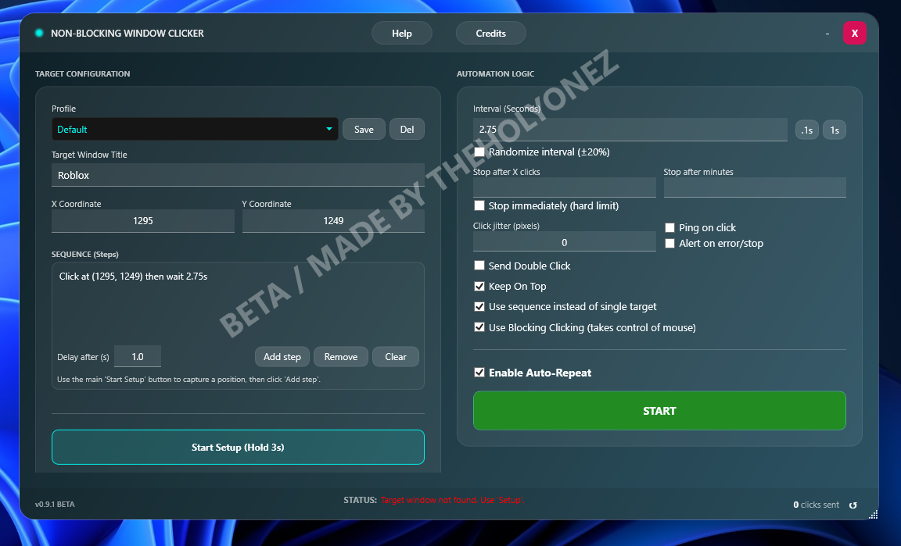
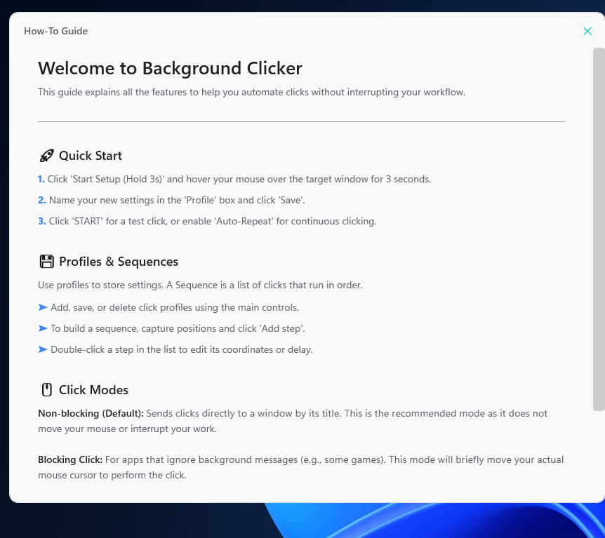
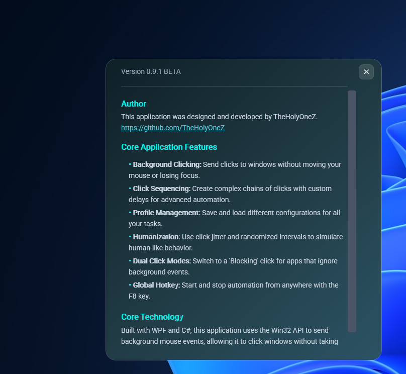

# Non-Blocking Window Clicker

Tired of automation tools that take over your mouse? This is a powerful WPF application designed for true background clicking. It sends commands directly to application windows, so you can keep working, gaming, or browsing without interruption.

---

## What It Does

This tool lets you automate mouse clicks at specific locations within a target application window. You can create simple auto-clickers or build powerful, multi-step sequences for complex tasks.

The key feature is its ability to work in the background. Unlike traditional macro tools that hijack your cursor, this application sends its commands directly, leaving your mouse free for you to use.

### Core Features:

-   **🖱️ True Background Clicks**: Utilizes non-blocking Win32 API calls to click windows without moving your mouse.
-   **💾 Profile System**: Save and load different automation profiles. Each profile stores the target window, click coordinates, sequences, and all timing settings.
-   **📜 Advanced Sequencing**: Chain multiple clicks together. Each step can have unique coordinates and a specific delay, allowing for complex automation routines.
-   **🤖 Humanization**: Optional "Click Jitter" (a random offset) and "Randomized Interval" settings make automation appear more human-like.
-   **🎯 Smart Targeting**: An easy-to-use setup mode lets you capture a target window and coordinates by simply holding your mouse over it for 3 seconds.
-   **Hotkey Control**: Start and stop the clicker instantly with a global **F8** hotkey, even when the application is minimized.
-   ** Blocking Mode**: For applications that don't respond to background clicks (like some games), a "Blocking" mode is available that will temporarily move the mouse to perform the click.

---

## How It Works

The application leverages the Windows operating system's own messaging system to communicate with other programs.

1.  **Window Discovery**: When you use the "Start Setup" feature, the tool identifies the unique handle (`HWND`) of the target window under your cursor. This handle is like a direct phone number to that window.
2.  **Sending Messages**: In the default non-blocking mode, instead of moving your mouse, the tool sends `WM_LBUTTONDOWN` and `WM_LBUTTONUP` messages directly to the target window's handle. This tells the application "a click happened at these coordinates" without ever involving your physical cursor.
3.  **Persistence**: All your saved profiles, including window titles and sequences, are stored in a `profiles.xml` file located in `%AppData%\BackgroundClickerWpf`, making them available every time you launch the app.

---

## Quick Start Guide

1.  **Launch the Application**.
2.  Open the program you want to automate clicks in.
3.  In the clicker, press the **"Start Setup (Hold 3s)"** button.
4.  Move your mouse over the target window and hold it still for 3 seconds. The window title and coordinates will be automatically filled in.
5.  Enter a name for your new settings in the **"Profile"** box and click **"Save"**.
6.  To run the clicker, press the green **"START"** button or use the **F8** hotkey.

---

## Gallery

### Main Interface

### How-To Guide

### Credits Screen

